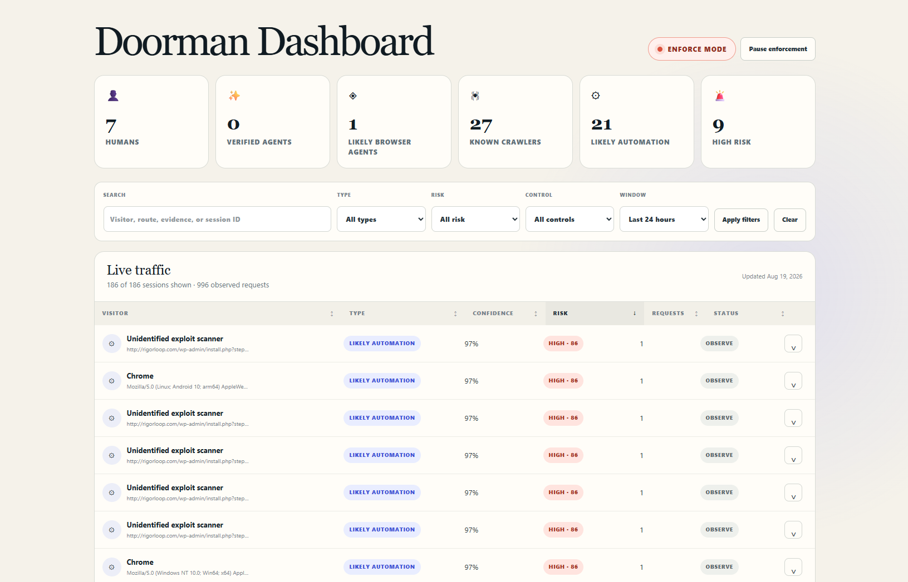
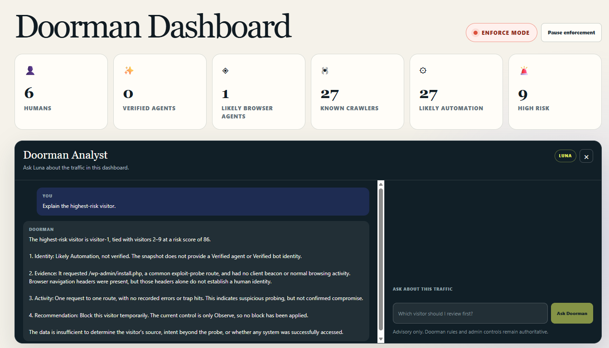
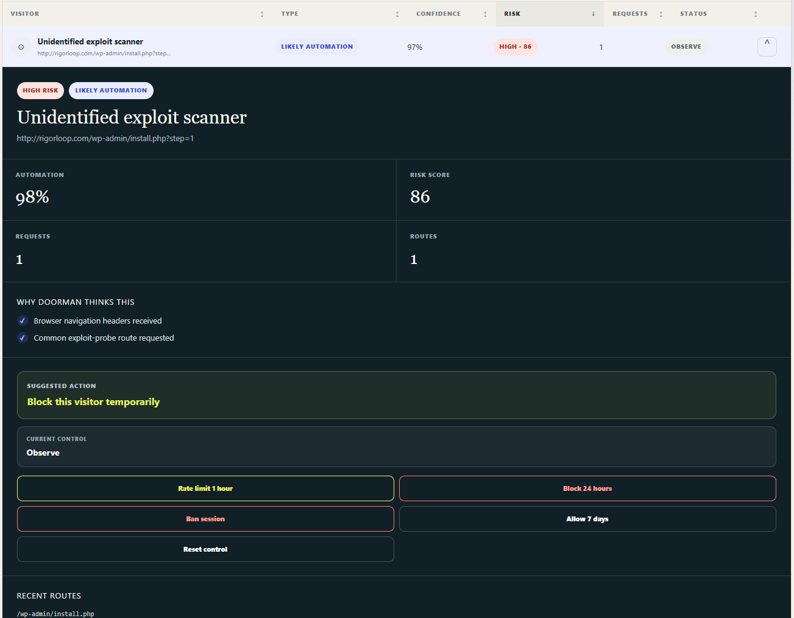

# Doorman

Doorman gives small organizations a clear view of website traffic. It identifies people, verified agents, known crawlers, likely automation, and unknown clients. It also scores risky behavior and explains each result.

Small businesses, schools, nonprofits, civic groups, and community organizations can use Doorman without a dedicated security team. One small package provides useful traffic evidence in plain language.

Doorman also includes an optional AI analyst. It turns a privacy-safe traffic snapshot into a plain-English explanation of current risks, likely automation, and useful next actions. The analyst is read-only. It explains evidence and recommends controls; your application remains responsible for every block, rate limit, and allow decision.

## Live example

The screenshots below show Doorman installed in one production application. The package remains independent of the host application, framework, and database.

The overview separates visitor identity from behavioral risk.



The optional AI analyst explains the current dashboard data and recommends a clear next step.



An expanded traffic session shows the evidence, risk score, and suggested action.



## What Doorman provides

Doorman answers two separate questions for each visitor:

1. What type of visitor is this?
2. How risky is its current behavior?

The package returns:

- a visitor classification;
- classification confidence;
- automation confidence;
- a risk score from 0 to 100;
- a readable client label;
- verified identity data when available;
- evidence for the result.

Your application can store these results, show them in a dashboard, and apply its own traffic policy.

## Requirements

- Node.js 18 or a later version
- A server that can read HTTP request headers
- A storage system for traffic history, if you want session analysis
- A server-side OpenAI API key, if you enable the optional AI analyst

Doorman supports the standard Web `Request` interface. You can use it with Node.js frameworks, serverless functions, and edge platforms.

## Install

Install the current public release from GitHub:

```sh
npm install github:brianross93/Doorman
```

Use this command after the package becomes available in the npm registry:

```sh
npm install doorman-traffic
```

## Inspect your first request

Create one Doorman instance when your server starts:

```js
import { createDoorman } from "doorman-traffic";

const doorman = createDoorman({ mode: "observe" });
```

Pass each server request to `inspectRequest`:

```js
const result = await doorman.inspectRequest(request);

console.log(result.classification);
console.log(result.riskScore);
console.log(result.evidence);
```

Start with `observe` mode. Review the results before you connect them to a blocking policy.

## Add the optional AI analyst

The AI analyst is a standalone Doorman capability. The host application supplies a privacy-safe dashboard snapshot and its own OpenAI API key. Doorman sends the snapshot through the OpenAI Responses API with response storage disabled.

Keep the API key on your server. Do not put it in browser code or a public environment variable.

```js
import { createDoormanAnalyst } from "doorman-traffic/analyst";

const analyst = createDoormanAnalyst({
  apiKey: process.env.OPENAI_API_KEY,
  model: process.env.DOORMAN_ANALYST_MODEL || "gpt-5.6-luna",
});

const result = await analyst.ask({
  snapshot: {
    windowHours: 24,
    totals: dashboard.totals,
    controls: dashboard.controls,
    highestSignalSessions: dashboard.sessions,
    privacyNote: "Network identifiers and full request headers are excluded.",
  },
  messages: [
    { role: "user", content: "What needs my attention?" },
  ],
});

console.log(result.answer);
```

Build the snapshot on your server. Include aggregate counts, risk scores, route shapes, request counts, control state, and short evidence strings. Keep API keys, cookies, authorization headers, raw network addresses, private query values, and data outside the analysis scope out of the snapshot.

Request classification, risk scoring, identity checks, the browser beacon, and traffic enforcement remain available when the AI analyst is disabled. Enable the analyst when your team wants to ask questions about the dashboard in plain language.

## Understand the result

A result has this structure:

```js
{
  classification: "likely_automation",
  classificationConfidence: 94,
  automationConfidence: 97,
  riskScore: 82,
  userAgentLabel: "Unidentified exploit scanner",
  identity: null,
  evidence: [
    "Common exploit-probe route requested",
    "No normal browser navigation headers received"
  ]
}
```

Doorman uses these classifications:

| Classification | Meaning |
| --- | --- |
| `human` | Browser activity has normal interactive signals. |
| `verified_agent` | A trusted provider or cryptographic signature verified an agent. |
| `verified_bot` | A trusted provider verified an automated service. |
| `known_crawler` | The client matches a known crawler identity. |
| `likely_automation` | Request signals strongly indicate automated software. |
| `unknown` | The available signals support more than one explanation. |

Use `riskScore` for behavior. Use `classification` for visitor type. Keep these decisions separate.

## Add request context

You can inspect selected request data directly:

```js
const result = doorman.inspect({
  userAgent: request.headers.get("user-agent"),
  path: new URL(request.url).pathname,
  browserNavigation: request.headers.get("sec-fetch-mode") === "navigate",
  signaturePresented:
    request.headers.has("signature") &&
    request.headers.has("signature-input"),
  agentCredentialPresented:
    request.headers.get("authorization")?.startsWith("Bearer ") ?? false,
});
```

Store the result with a privacy-safe session identifier. Add request counts, route counts, error counts, and time windows in your application. These values help you identify scraping, enumeration, repeated failures, and high request volume.

## Add the optional browser beacon

The browser beacon adds interaction signals from your own pages:

```js
import { startDoormanBeacon } from "doorman-traffic/client";

const stop = startDoormanBeacon({
  endpoint: "/api/doorman/beacon",
});
```

The beacon sends:

- event counts;
- session duration;
- page visibility;
- the browser `webdriver` flag.

These small signals help your server distinguish interactive browsing from automated access. Your beacon endpoint must connect the signal to the correct traffic session.

## Add a known-client directory

Use a directory when your organization recognizes specific crawlers or agents:

```js
import {
  createDoorman,
  createRegistryIdentityProvider,
} from "doorman-traffic";

const directory = createRegistryIdentityProvider([
  {
    name: "Community Research Crawler",
    operator: "Community Lab",
    purpose: "research",
    kind: "BOT",
    userAgentPatterns: ["CommunityResearchBot/*"],
  },
]);

const doorman = createDoorman({
  mode: "observe",
  identityProviders: [directory],
});
```

A directory match supplies listed identity evidence. Use stronger assurance for verified identity.

## Verify agents with Web Bot Auth

Web Bot Auth uses HTTP message signatures. Supply a trusted public-key resolver:

```js
import {
  createDoorman,
  createWebBotAuthIdentityProvider,
} from "doorman-traffic";

const webBotAuth = createWebBotAuthIdentityProvider({
  async resolveKey({ keyid, signatureAgent }) {
    const record = await trustedDirectory.lookup({
      keyid,
      signatureAgent,
    });

    if (!record) return null;

    return {
      jwk: record.publicJwk,
      identity: {
        type: "agent",
        name: record.name,
        operator: record.operator,
        purpose: record.purpose,
      },
    };
  },
});

const doorman = createDoorman({
  mode: "observe",
  identityProviders: [webBotAuth],
});
```

Resolve keys from a directory that you trust. Validate and cache directory records before request processing.

## Use trusted Cloudflare signals

Applications on Cloudflare can use Bot Management data from the platform request object:

```js
import {
  createCloudflareIdentityProvider,
  createDoorman,
} from "doorman-traffic";

const cloudflare = createCloudflareIdentityProvider({ trusted: true });

const doorman = createDoorman({
  mode: "observe",
  identityProviders: [cloudflare],
});

const result = await doorman.inspectRequest(request, {
  cloudflare: request.cf,
});
```

Set `trusted: true` only for metadata from the Cloudflare platform request object.

Cloudflare Radar publishes a verified-bot directory. Use `fetchCloudflareRadarDirectory` to download a snapshot. Cache the snapshot, then pass it to `createRegistryIdentityProvider`.

## Apply a traffic policy

Doorman supplies evidence and scores. Your server applies the control.

Use these stages:

1. Observe traffic.
2. Review classifications and risk scores.
3. Set limits for your site.
4. Add rate limits for repeated high-volume access.
5. Add temporary blocks for high-risk sessions.
6. Record each control and its reason.
7. Provide a reset or allow action for an administrator.

This example shows a simple high-risk response:

```js
const result = await doorman.inspectRequest(request);

if (result.riskScore >= 80) {
  return new Response("Request blocked by site policy", {
    status: 403,
  });
}
```

Combine the request result with session history before you enforce production traffic controls.

## Protect visitor privacy

Collect the minimum data needed for a useful decision.

- Hash network identifiers before storage.
- Remove query strings from stored routes.
- Store route shapes instead of private resource identifiers.
- Store event counts instead of typed text or pointer coordinates.
- Set a short retention period for routine traffic events.
- Keep administrator actions in an audit record.

## Run the tests

Clone the repository. Then install dependencies and run the test suite:

```sh
npm install
npm test
```

The tests cover crawler identity, automation signals, exploit probes, route shaping, Cloudflare metadata, Web Bot Auth, and browser-agent hypotheses.

## Package boundary

The package provides:

- request classification;
- identity-provider adapters;
- risk scoring;
- route shaping;
- evidence;
- an optional browser beacon;
- an optional, host-configured AI analyst.

The host application provides:

- session storage;
- the traffic dashboard;
- alerts;
- trusted directory policy;
- rate limits and blocks;
- administrator access control;
- retention policy.

This boundary keeps Doorman portable across frameworks, databases, and hosting providers.

## Open-source components

Doorman uses [`web-bot-auth`](https://www.npmjs.com/package/web-bot-auth) to verify HTTP message signatures. The package manifest records the dependency and version range.

## License

Doorman uses the MIT License.
